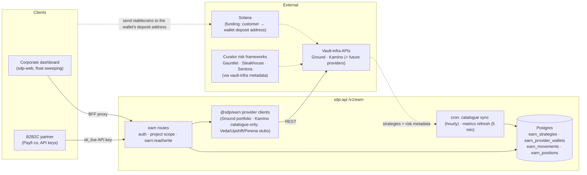

# Earn V1 — data flow & SDP reuse map

Companion to [ADR 0002](../decisions/0002-earn-provider-pluggability.md). The
scaffold on `earn-initial` shows the *shape*; this doc shows where every piece
of data comes from **in the real build**, and which existing SDP components
Earn rides on instead of rebuilding. Rule of thumb: **Earn adds a domain, not
a platform** — auth, tenancy, custody, signing, fees, RPC, webhooks, cron,
compliance, policies, and audit all already exist and are reused. For the
step-by-step of changing what Earn offers (provider / vault / category /
custodian), see the
[Earn pluggability playbook](../contributing/earn-pluggability-playbook.md).

## System context



Execution-era boxes (custody signing, per-strategy movement webhooks, NAV/
reconcile crons) left this diagram with PRO-1628: V1 ships none of them, and
the machinery they described was removed rather than documented as aspiration.
PRO-1634 owns whatever returns.

## Where each surface gets its data (source of truth)

| Surface | Serving read | Fed by | Freshness |
|---|---|---|---|
| Strategy catalogue | `earn_strategies` (DB) | Cron sync ← provider `listStrategies` (curator/risk metadata rides along as `risk_metadata`); snapshots outside the client's `declaredSupport` are skipped fail-closed (`isStrategyWithinDeclaredSupport`, `@sdp/earn/support`) | Hourly (`cron/earn-catalogue-sync.ts`) — identity, mints, liquidity terms and **admission** only |
| APY + vault TVL/holders | `earn_strategies.current_apy` / `risk_metadata` (DB) + live `getPortfolioYield` for the program-level rate | Metrics refresh ← provider `listStrategyMetrics` (`supportsLiveMetrics`); live provider read | **Every 5 min** (`cron/earn-metrics-refresh.ts`) / real-time |
| Whether a strategy is fundable *here* | Derived per request from `earn_strategies.host_cluster` vs the caller's environment — the `fundable` field on `GET /strategies` | `isClusterFundableInEnvironment` (`@sdp/earn`) | Real-time (never stored) |
| Program list | `earn_provider_wallets` (**DB**, oldest first) joined per row with a **live provider snapshot** — `GET /v1/earn/programs` | Rows written by create; snapshots fetched in parallel per listed program | Real-time |
| Positions & balances | **Live provider snapshot** (`GET /v1/earn/programs/:programId` ← `getPortfolioWallet`) — never persisted | Provider | Real-time |
| Deposits | **Live provider** (`GET /programs/:programId/deposits` ← provider-observed on-chain deposits) — customer-initiated, so SDP has no intent moment to ledger | Provider | Real-time |
| Withdrawals (detail) | **Live provider** (`GET /programs/:programId/withdrawals/:ref`); the matching ledger row advances as a side effect | Provider | Real-time |
| Withdrawals (history/audit) | `earn_movements` (**DB ledger** — `GET /programs/:programId/withdrawals`) | Written at intent by `POST /programs/:programId/withdrawals`; advanced by guarded CAS on every observation (`services/earn-withdrawal-ledger.service.ts`) | Intent = immediate; status = each observation (+ ledger sweep) |
| Vault deposits (history/audit) | `earn_movements` (**DB ledger** — `GET /vault-deposits`, `GET /vault-deposits/:movementId`) | Written at intent BEFORE broadcast; advanced by the reconciliation sweep to `confirmed` and then `finalized` | Intent = immediate; settlement ≈ 90s (`cron/earn-vault-movements.ts`) |
| Vault holdings | `earn_positions` (**DB claim index**, never a balance) **hydrated live from chain** — `GET /vault-positions` | Claim written with the first durable signed intent; shares and value read live per request | Claim = immediate; value = real-time |
| Movement history, ALL providers | `earn_movements` (**DB ledger** — `GET /v1/earn/movements`) | Every movement above, one chronological feed across both execution models; no provider gate (ADR 0002 exit safety) | Same as the rows it serves |
| Wallet balances (funding) | Existing wallet/custody surfaces | Existing RPC relay + token account reads — nothing Earn-specific | Existing behavior |
| Provider on/off state | `getProviderAvailability` (existing service, `earn` family already wired) | Org entitlements + env credentials | Real-time |

> **Ledger vs live — DECIDED (PRO-1628, ADR 0002 addendum 2026-08-11).**
> *SDP ledgers what SDP initiates; SDP reads live what the provider observes.*
> Positions/balances/deposits are live provider reads, permanently — the
> empty execution-era ledgers (`earn_positions`, `earn_movements`, their
> routes) were dropped by migration `0055`. Withdrawals — the one money
> movement SDP initiates — get `earn_program_withdrawals`: written at intent
> (which also gives the derived idempotency key an SDP-side anchor, ending
> the era when the caller's key was the entire duplicate-defense), advanced
> by guarded CAS on every observation, and listed as the audit surface. The
> provider remains the authority for live status and final amounts; the
> ledger relays provider truth, never replaces it.

> **Catalogue vs figures — split by how fast the thing moves (2026-08-13).**
> The catalogue row and the numbers on it now have different cadences and
> different writers. The hourly sync owns identity, mints, liquidity terms and
> ADMISSION; a five-minute refresh owns `current_apy` and volatile
> `risk_metadata`, and it is UPDATE-only — it cannot insert, so it can never
> admit a vault the catalogue gates refused, and its input type carries figures
> only, so it cannot change what a strategy is. This keeps rates quotable
> without breaking the one-source rule above: `GET /strategies` is still a plain
> DB read, and freshness comes from cadence rather than from blending a live
> overlay onto stored rows.
>
> **Catalogued ≠ fundable (2026-08-13; Kamino premise corrected 2026-08-14).**
> The catalogue may list instruments that do not exist on every cluster.
> Kamino was the original example — believed mainnet-only and catalogued into
> both environments — but it has a devnet deployment, and non-production now
> catalogues devnet vaults while the sync refuses to STORE a `mainnet-beta`
> instrument outside production. `host_cluster` states where the instrument
> lives, and the derived
> `fundable` answers the caller's actual question. Three gates read the one
> predicate — `assertKnownYieldSources` before any provider mutation, the wire
> field, and the dashboard's strategy filter.

**No new indexer.** V1 needs no event-sourced chain indexer: the catalogue
comes from provider APIs and position truth is the live provider snapshot.
That is now decided, not provisional (PRO-1628) — deposits stay unledgered in
V1 precisely because observing customer-initiated transfers from chain is
indexer-shaped work. If V2 needs richer on-chain history (per-block share
price, protocol events), that's the point to evaluate an indexer — not V1.

## Execution era (PRO-1634 — arrived for `vault_direct`)

**This is now half true.** For the CUSTODIAL shape it still holds exactly: a
Ground program is funded by sending stablecoins to its deposit address, with no
SDP-built transaction and no custody signing.

For the NON-CUSTODIAL (`vault_direct`) shape it no longer does. A K-Vault has no
address to send to, so the only way money moves is SDP building an instruction,
signing it with an organization custody wallet and submitting it. That path
exists: `@sdp/kamino` builds the plan, `POST /v1/earn/vault-deposits` signs and
submits, and `earn_movements` ledgers it — written at intent BEFORE signing,
because the chain has no request-id dedupe and a crash between signing and
recording is otherwise unrecoverable. `earn_positions` records only WHICH
(wallet, vault) pairs an org holds; shares and value stay live chain reads, so the
ledger-vs-live rule above is unchanged.

That ledger started as `earn_vault_movements` (migration 0059, *not* 0058 as this
document previously said) beside the custodial `earn_program_withdrawals` — two
authoritative tables split by execution mechanism. PRO-1705 merged them into one
`earn_movements` root and one `earn_positions` holdings table (migrations
0062-0065; ADR 0002 addendum 2026-08-19). The legacy tables still take the writes
and are mirrored into the unified shape in the same transaction until a later
release retires them, so the sources of truth in the table above are the unified
ones for every READ.

The withdraw counterpart landed with PRO-1702: `POST /v1/earn/vault-withdrawals`
records one share-mint-denominated signed movement before broadcasting it, and
the treasury dashboard's exit action drives it. The shared vault reconciliation
sweep finishes an ambiguous or interrupted submission. Production vault
deposits remain closed until PRO-1703 surfaces vault positions on the Active
tab (`VAULT_DIRECT_DEPOSIT_ENVIRONMENTS`); the exit route itself takes no
environment gate — money out beats money off.

The original V1 note, still accurate for the custodial model: The execution-era design that
used to be diagrammed here (per-strategy `createDeposit`/`createWithdrawal`,
`/movements/:id/submit`, movement webhooks + `getMovementStatus` reconcile
polling) was **removed from the codebase by PRO-1628** because none of it had
an implementation in any provider and its types referenced tables that no
longer exist. If PRO-1634 revives execution endpoints, design them against
real flows then — git history (`0048_earn.sql`, the pre-0055 `@sdp/earn`
contract) preserves the sketch, and the withdrawal ledger's insert-at-intent +
guarded-CAS shape is the pattern to extend.

## Existing SDP we leverage (build ≠ rebuild)

| Existing component | Where | Earn uses it for | Status |
|---|---|---|---|
| Auth + API keys + permissions | `middleware/auth.ts`, `@sdp/types/permissions` | `earn:read`/`earn:write` gating, partner `sk_live` access | ✅ wired in scaffold |
| Org/project tenancy | `projectContextMiddleware` | Program + withdrawal-ledger scoping (rows carry org/project; every program lookup is scoped to org **and** environment, and the ledger anchors on the program wallet) | ✅ wired |
| Provider entitlements | `services/provider-availability.service.ts` | Per-org enable/disable (override-only: every org needs an explicit `providerOverrides.earn.<id>`), env kill-switch, exit-safe gate | ✅ wired (`earn` family) |
| Custody + signing | `services/solana`, `@sdp/custody` | Vault-direct deposits sign provider-built instructions with the admitted organization wallet after policy enforcement | ✅ vault deposits |
| Fee sponsorship | `@sdp/payments/fee-payment` (Kora), `services/earn/vault-sponsorship.ts` | Sign-only sponsorship of the network fee **and** share-ATA rent, resolved once per request and applied to the fee payer, the provider's `rentPayer` and the simulation payer together. The exit closes the share ATA and refunds its rent to whoever funded it: `earn_positions.share_ata_rent_funder` (0066), written by whichever movement in either direction actually created the account, or this exit's own rent payer when the exit creates it. Cluster-gated to devnet and off by default: deployed devnet still needs the Kamino ids on its Kora allowlist (sdp-infra#64); mainnet additionally needs `allow_create_account` opened and `sbp_mainnet_global` enabled (PRO-1736) | ✅ code · ⏸ devnet deploy · ⏸ mainnet |
| Solana RPC | `@sdp/rpc`, `services/earn/execution-registry.ts` | Cluster-proved provider build, simulation, broadcast, and live vault-position hydration | ✅ vault-direct paths |
| Helius DAS | `services/helius-das.service.ts` | No V1 consumer — positions are live provider reads, nothing to reconcile | ⏸ none in V1 |
| Webhook dispatch + signature verify | `routes/webhooks/handlers.ts`, `lib/webhook-signature.ts` | Provider settlement events land on the withdrawal ledger via the same applier the poll path uses (`earn-withdrawal-ledger.service.ts`) | ⏸ PRO-1631 (polling works today; the neutral event contract returns with it) |
| Cron infra (3 entrypoints) | `cron/runner.ts`, `index.ts scheduled`, `job.ts`; precedent `cron/pending-transfers.ts` | Catalogue sync + the withdrawal-ledger sweep (heals ref-less intent rows; launch-coupled follow-up ticket) | ✅ catalogue sync (`cron/earn-catalogue-sync.ts`, hourly, gated on `isEarnEnabled` — `MARKETS_ENABLED` **and** `EARN_ENABLED`) · 🔨 ledger sweep |
| Idempotency | `middleware/idempotency-key.ts` + `lib/idempotency.ts` (derived request id, fingerprint replay) + `earn_program_withdrawals` (wallet, request_id) unique + `earn_provider_wallets` (provider, provider_wallet_ref) unique | Two-layer withdrawal retry safety: SDP intent row first, provider request-id dedupe as the crash-window backstop. Program **creation** is key-required too (PRO-1670) and derives against (org, environment, provider); the provider replays a retried create with the original wallet ref, so the global wallet-ref unique is what catches it — a violation there means "already created", answered 200, never 409 | ✅ wired (PRO-1628, PRO-1670) |
| Compliance providers | `services/compliance/`, compliance family | RWA strategy KYC / depositor checks (open decision) | ⏸ decision pending |
| Policies + approvals | policy/approval domains (`policy.repository`, approvals UI) | Vault deposits emit `program` / `earn_vault_deposit`, enforce before custody, and fence approved retries against the signed-intent transaction | ✅ vault deposits · ⏸ remaining Earn writes |
| Audit log | `services/audit.service.ts` | Deposit/withdraw/config audit events | 🔨 execution phase |
| Secrets/env plumbing | Doppler → `secret-keys.mjs` → workers | Provider API keys (already registered) | ✅ wired |
| OpenAPI → docs pipeline | `openapi/spec.ts` → sdp-docs | Public `/v1/earn` reference once the Markets/Earn flags flip | ⏸ deliberately deferred |

**Net-new (Earn-only) components:** the provider clients in `@sdp/earn`
(Ground is live — see below; the rest remain `StubEarnClient` subclasses
carrying `provider` + `declaredSupport`, filled in method-by-method), the
portfolio-wallet capability (`EarnPortfolioWalletProvider` +
`supportsPortfolioWallets` in `@sdp/earn/capabilities`), the
`earn_provider_wallets` table (migration `0049`; migration `0056` lifted its
one-per-org cap so an org may hold N programs per environment+provider, and
moved uniqueness onto the provider wallet itself — one link row per
`(provider, provider_wallet_ref)` platform-wide), the withdrawal ledger
(`earn_program_withdrawals`, migration `0055`) with its status machine in
`services/earn-withdrawal-ledger.service.ts`, and the catalogue-sync cron
(`cron/earn-catalogue-sync.ts`).

## Ground — the first live provider (portfolio-wallet flow)

The dashboard's mock seam (`earn-mock-data.ts`) is replaced by a live path
built on `GroundEarnClient` (`@sdp/earn/providers/ground/client`), which
implements `EarnPortfolioWalletProvider`. Auth is a Bearer key from env
(`GROUND_SANDBOX_API_KEY` / `GROUND_API_KEY`); a missing key fails closed
with `PROVIDER_NOT_CONFIGURED` before any request leaves the process.

```mermaid
flowchart LR
    GY["Ground GET /v2/wallets/yield-sources"] -->|hourly cron| SYNC["earn-catalogue-sync"]
    SYNC -->|declared-support validated| ES[("earn_strategies")]
    ES --> CAT["GET /v1/earn/strategies"]

    PROG["/v1/earn/programs<br/>list · create · get · re-target"] --> EPW[("earn_provider_wallets")]
    PROG -->|create wallet / update strategy / snapshot| GW["Ground /v2/wallets"]

    FUND["Solana deposit address<br/>(from wallet snapshot)"] -.->|user sends USDC| GW
    GW -->|GET deposits (poll)| DEP["deposit tracking"]

    WD["portfolio withdrawal<br/>(amountUsd + token + solana dest)"] --> GW
```

- **Catalogue.** Cron calls Ground's cursor-paginated
  `GET /v2/wallets/yield-sources`; each source maps to a strategy snapshot
  (apyBps→decimal, redeem policy→instant/delayed, curator derived from known
  ids → `morpho-<curator>-<token>` convention → protocol fallback,
  dominant-allocation rwa/defi classification, tvl/utilization into
  `riskMetadata`). Four gates drop a source before it can be catalogued, in
  that order (`distillGroundYieldSource`): `mode !== "active"` — `buy_only`
  would take deposits into an exit-frozen source and `sell_only`/
  `emergency_freeze` cannot take deposits at all; a deposit token Ground does
  not route on Solana (`GROUND_SOLANA_ROUTED_TOKENS` is USDC only), which is
  un-fundable and un-exitable through SDP's Solana-only surface on *every*
  cluster; an unrecognized token symbol; and no well-known mint on this
  environment's cluster. Routability is the gate that actually bites: all 3 of
  sandbox's 18 sources that never reach the catalogue are dropped
  `not_solana_routable` — USDT twins of vaults already catalogued in USDC
  (`docs/earn/ground-catalogue-inventory.md`). Rows land in `earn_strategies`
  via the standard sync.
- **Programs.** One Ground wallet = one SDP program, recorded in
  `earn_provider_wallets`; an org may hold several per environment (PRO-1670),
  and the only uniqueness left is global on `(provider, provider_wallet_ref)`.
  `POST /v1/earn/programs` creates one (`POST /v2/wallets`, polled from
  `creating` to `ready`); `PUT /v1/earn/programs/:programId` replaces that
  program's strategy in place (`PATCH /v2/wallets/{id}/strategy`). Create
  **requires** a caller idempotency key — exactly one of body `requestId` or the
  `Idempotency-Key` header — because with N programs legal nothing downstream
  can tell a retry from a genuine second program; SDP derives it against
  (org, environment, provider) before it reaches Ground, and answers a provider
  replay (which returns the original wallet ref, so the insert hits the global
  unique) with the existing program at **200** instead of **201**.
  A selection is exactly ONE strategy at
  `pct: 100` of that strategy's stablecoin lane (`singleStrategyAllocation`) —
  a shape the API enforces, not just a wizard convention: PRO-1667 caps each
  token group at one allocation entry per program, leaving the weighted wire
  shape dormant — the API side of post-V1 re-enablement is just relaxing that
  cap, while the dashboard would separately need weight authoring and share
  display back (concurrent strategies arrive as separate single-vault
  programs, PRO-1670).
  The curator-first step and the weight editor were removed on purpose —
  curator is metadata rendered beside a strategy, never a gate — and an
  omitted lane keeps its current allocation server-side. Positions and
  balances are read live from the wallet snapshot and rendered as a flat
  value-ordered holdings list, not grouped by curator — no SDP-side position
  ledger for the portfolio surface.
- **Funding.** The wallet snapshot exposes its Solana deposit address
  (`solana_devnet` sandbox / `solana` production); users fund by sending
  USDC there — Ground's Solana rails carry USDC only
  (`GROUND_SOLANA_ROUTED_TOKENS`), with USDT riding Ethereum (mainnet in
  production, Sepolia in sandbox), so the funding lane and the payout lane
  (`assertSolanaRoutable`) agree on one stablecoin. Deposits are tracked via
  Ground's cursor-paginated deposits API. No custody signing in V1.
- **Withdrawals.** Portfolio-level: preview
  (`POST .../withdrawal-preview`) — whose `amountUsd` is **optional**, so the
  same call serves two jobs: omitted it is the LIQUIDITY read (what the lane can
  pay right now, PRO-1675), present it also validates that amount and quotes its
  fee — then create
  (`POST .../withdrawals`, caller-owned requestId — a 409
  `request_id_conflict` surfaces as `CONFLICT`), pinned to the environment's
  Solana rail, then status-polled over `EARN_PORTFOLIO_WITHDRAWAL_STATUSES`
  (`@sdp/types/earn`): `processing`, `pending_approval`, `completed`,
  `partially_completed`, `failed`, `cancelled`. `pending_approval` is
  SDP-derived, not a Ground status — Ground leaves the withdrawal at
  `processing` while a payout leg (or a step inside it) sits in
  `pending_customer_approval` awaiting the customer's Turnkey stamp, so
  `mapWithdrawal` folds that up into the distinct wire status rather than
  leaving a blocked exit indistinguishable from one in flight. It never
  overrides a terminal status: once a withdrawal settles, leg states are
  history. Destination whitelisting is available as an explicit address-book
  call, not folded into the withdrawal flow. Every create also writes the
  SDP-side intent row and every observation advances it (PRO-1628) — see the
  source-of-truth table above.
- **Settlement signal: polling, for now.** Ground offers Stripe-style
  HMAC-signed webhooks; wiring them into the existing webhook dispatch is
  future work — V1 polls deposit and withdrawal status.

## Open infra decisions (mirror of the V1 decision list)

1. **NAV source of truth** — *rescoped by PRO-1628*: the unreachable NAV
   surface was unpublished (no table, no endpoint, no contract method), so the
   remaining question is purely a decision — provider API vs on-chain read vs
   both — to be made when a real NAV-history consumer exists.
2. **Settlement signal** — webhook-primary with poll backstop (ramps pattern,
   assumed above) vs poll-only for providers without webhooks. *Resolved for
   Ground V1: poll-only; its HMAC webhooks are future work (see above).*
3. **Compliance hook** — do RWA deposits require a compliance-provider check
   (Genius-compliant tokens need app whitelisting — JOLT/B-reserves)?
4. **Policy engine scope** — which of whitelist/buffer/limits/timelocks land in
   V1, and whether they graft onto the existing policy/approvals domain.
